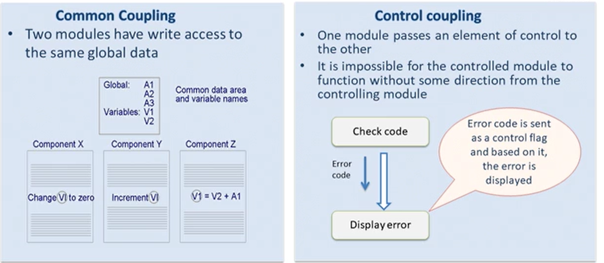

## Algorithm
- set of finite no of statements.
- definite begining and ending.

## Flowchart
- diagramatical representation of algo
- lines and arrows

## Pseudo code
- informal way of describing flowchart
- redable, modular

## Flow of program
- order in which computer executes statements
- can be sequential, conditional, loop

## Array
- used to store large amount of data
- container with equally spaced slots
- data could be stored continously, and type would be same

## Characteristics of s good program

- Readability
- Maintanability - evolve to meet changing needs
- Robustness - ability to cope with errors
- Efficiency - least memory and time
- Documentation
- Modularity

## Coupling
- degree of interaction between modules
- 2 modules are tightly coupled when they depend a great deal on each other

- Correctness is how correct the program is giving output and robustness if program is handling incorrect inputs

## Cohesion
- dependency among the internal elements of module
- greater cohesion is good

