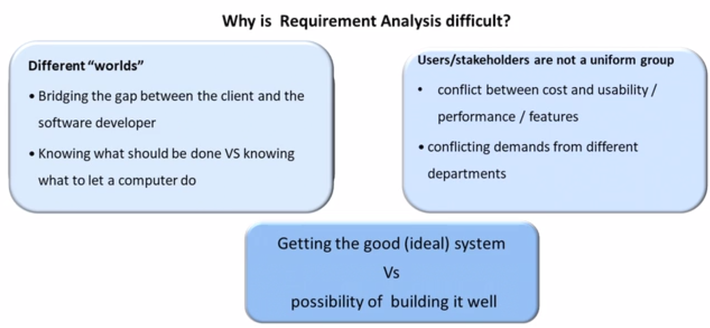

## Requirement Engineering
- It is the process of defining, documenting and maintaning the requirements.
- It involves the following steps
1. Requirement Elicitation
2. Requirement Analysis
3. Requirement Documentation
4. Requirement Review

### 1. Requirement Elicitation

- Requirements elicitation is the process of gathering and defining the requirements for a software system from stakeholders.
- It can be grouped into 3 categories
  1. Address problems of scope - not gathering uneccasary info and remain in boundary
  2. Address problem of understanding - user may have problem in communication, may give ambigous info. Analyst may not be good in that problem domain
  3. Address problems of volatility - changing requirements

### 2. Requirement Analysis

- The process of determining user expectations for a new or modified product. It is usually a team effort and demands a variety of human soft skills, such as critical thinking, communication and judgment.

#### Goals
- understand user's req.
- remove inconsistencies and anomalies
- document in SRS

#### System Analyst
- a person who performs req. analysis

### 2 activities of requirement analysis

1. Req. gathering
2. Analysis of gathered req.

## SRS
- requirements are documented in standard document called Software Requirement Specification.
- a contract between customer and developer
- outcome of analysis phase
- concentrates on
  - what needs to done
  - and avoids the solution

- useful in various contexts
  - statement of user's need
  - contract document
  - reference doc
  - definition for implementation

### Example of Functional req.

- a system must send an email when an order is placed

## Entity Relationship Diagram
- conceptual level of DB
- describes relationships in high level

